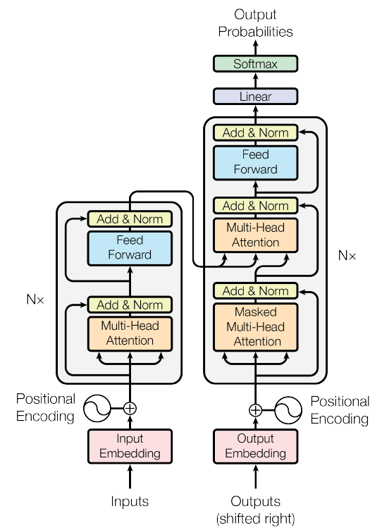

  [![Contributors][contributors-shield]][contributors-url] [![Forks][forks-shield]][forks-url] [![Stargazers][stars-shield]][stars-url] [![Issues][issues-shield]][issues-url] [![MIT License][license-shield]][license-url] [![LinkedIn][linkedin-shield]][linkedin-url]

<!-- PROJECT LOGO -->
<br />

<p align="center">
  <a href="https://github.com/vineeths96/Compressed-Transformers">
    
  </a>
  <h3 align="center">Compressed Transformers</h3>
  <p align="center">
    Transformer Model Compression for Edge Deployment
    <br />
    <a href=https://github.com/vineeths96/Compressed-Transformers><strong>Explore the repository»</strong></a>
    <br />
    <a href=https://github.com/vineeths96/Compressed-Transformers/blob/master/docs/report.pdf>View Report</a>
  </p>

</p>

> tags : model compression, transformers, edge learning, federated learning, iwslt translation, english, german, deep learning, pytorch 


<!-- ABOUT THE PROJECT -->

## About The Project

Transformer architectures and their extensions such as BERT, GPT etc, has revolutionized the world of Natural Language, Speech and Image processing. However, the large number of parameters and the computation cost inhibits the transformer models to be deployed on edge devices such as smartphones. In this work, we explore the model compression for transformer architectures by quantization. Quantization not only reduces the memory footprint, but also improves energy efficiency. Research has shown that 8 bit quantized model uses 4x lesser memory and 18x lesser energy. Model compression for transformer architectures would lead to reduced storage, memory footprint and compute power requirements. We show that transformer models can be compressed with no loss of or improved performance on the IWSLT English-German translation task. We specifically explore quantization aware training of the linear layers and demonstrate the performance for 8 bits, 4 bits, 2 bits and 1 bit (binary) quantization. We find that the linear layers of the attention network to be highly resilient to quantization and can be compressed aggressively. A detailed description of quantization algorithms and analysis of the results are available in the [Report](./docs/report.pdf).


### Built With
This project was built with 

* python v3.8.3
* PyTorch v1.5
* The environment used for developing this project is available at [environment.yml](environment.yml).


<!-- GETTING STARTED -->

## Getting Started

Clone the repository into a local machine and enter the [src](src) directory using

```shell
git clone https://github.com/vineeths96/Compressed-Transformers
cd Compressed-Transformers/src
```

### Prerequisites

Create a new conda environment and install all the libraries by running the following command

```shell
conda env create -f environment.yml
```

The dataset used in this project (IWSLT English-German translation) will be automatically downloaded and setup in `src/data` directory during execution.

### Instructions to run

The `training_script.py` requires arguments to be passed (check default values in [code)](src/training_script.py):

- `--batch_size` - set to a maximum value that won't raise CUDA out of memory error
- `--language_direction` - pick between `E2G` and `G2E`
- `--binarize` - binarize attention module linear layers during training 
- `--binarize_all_linear` - binarize all linear layers during training 

- `--quantize` - quantize attention module linear layers during training 
- `--quantize_bits`- number of bits of quantization
- `--quantize_all_linear` - quantize all linear layers during training 

To train the transformer model without any compression,

```sh
python training_script.py --batch_size 1500
```

To train the transformer model with binarization of attention linear layers,

```sh
python training_script.py --batch_size 1500 --binarize True
```

To train the transformer model with binarization of all linear layers,

```sh
python training_script.py --batch_size 1500 --binarize_all_linear True
```

To train the transformer model with quantization of attention linear layers,

```sh
python training_script.py --batch_size 1500 --quantize True --quantize_bits 8
```

To train the transformer model with quantization of all linear layers,

```sh
python training_script.py --batch_size 1500 --quantize_all_linear True --quantize_bits 8
```


## Model overview

The transformer architecture implemented follows from the seminal paper [Attention Is All You Need](https://arxiv.org/pdf/1706.03762.pdf) by Vaswani et al. The architecture of the model is shown below.


<!-- RESULTS -->

## Results

We evaluate the baseline models and proposed quantization methods on IWSLT dataset. We use Bilingual Eval. More detailed results and inferences are available in report [here](./docs/report.pdf).

| Model | BLEU Score |
| :------------------------------------------: | :-----------------: |
| Base line (Uncompressed)           | 27.9       |
| Binary Quantization (All Linear) | 13.2         |
| Binary Quantization (Attention Linear) | **26.87** |
| Quantized - 8 Bit (Attention Linear) | **29.83**  |
| Quantized - 4 Bit (Attention Linear) | **29.76**  |
| Quantized - 2 Bit (Attention Linear) | **28.72** |
| Quantized - 1 Bit (Attention Linear) | **24.32** |
| Quantized - 8 Bit (Attention + Embedding) | 21.26 |
| Quantized - 8 Bit (All Linear) | **27.19**  |
|      Quantized - 4 Bit (All Linear)       | **27.72**  |

The proposed method can also be used for post-training quantization with minimal performance loss (< 1%) on pretrained BERT models. (Results are not shown due to lack of space).


<!-- LICENSE -->

## License

Distributed under the MIT License. See `LICENSE` for more information.


<!-- CONTACT -->
## Contact

Vineeth S - vs96codes@gmail.com

Project Link: [https://github.com/vineeths96/Compressed-Transformers](https://github.com/vineeths96/Compressed-Transformers)


<!-- MARKDOWN LINKS & IMAGES -->
<!-- https://www.markdownguide.org/basic-syntax/#reference-style-links -->

[contributors-shield]: https://img.shields.io/github/contributors/vineeths96/Compressed-Transformers.svg?style=flat-square
[contributors-url]: https://github.com/vineeths96/Compressed-Transformers/graphs/contributors
[forks-shield]: https://img.shields.io/github/forks/vineeths96/Compressed-Transformers.svg?style=flat-square
[forks-url]: https://github.com/vineeths96/Compressed-Transformers/network/members
[stars-shield]: https://img.shields.io/github/stars/vineeths96/Compressed-Transformers.svg?style=flat-square
[stars-url]: https://github.com/vineeths96/Compressed-Transformers/stargazers
[issues-shield]: https://img.shields.io/github/issues/vineeths96/Compressed-Transformers.svg?style=flat-square
[issues-url]: https://github.com/vineeths96/Compressed-Transformers/issues
[license-shield]: https://img.shields.io/badge/License-MIT-yellow.svg
[license-url]: https://github.com/vineeths96/Compressed-Transformers/blob/master/LICENSE
[linkedin-shield]: https://img.shields.io/badge/-LinkedIn-black.svg?style=flat-square&logo=linkedin&colorB=555
[linkedin-url]: https://linkedin.com/in/vineeths

